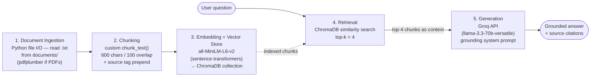

# Project 1 Planning: The Unofficial Guide

> Write this document before you write any pipeline code.
> Your spec and architecture diagram are what you'll use to direct AI tools (Claude, Copilot, etc.) to generate your implementation — the more specific they are, the more useful the generated code will be.
> Update the Retrieval Approach and Chunking Strategy sections if you change your approach during implementation.
> Update this file before starting any stretch features.

---

## Domain

<!-- What domain did you choose? Why is this knowledge valuable and hard to find through official channels? -->

**Financial aid navigation at Ohio State University.** Covers how students actually handle FAFSA timing, aid-package appeals, finding lesser-known scholarships, work-study vs. part-time work, and billing gaps (bill due before disbursement).

This knowledge is valuable because official financial-aid pages document *procedures and deadlines* but not *lived outcomes* — which appeals succeed, realistic timelines, and workarounds. That knowledge is spread across student forums and posts, is sometimes contradictory, and is hard to find through official channels.

---

## Documents

<!-- List your specific sources: URLs, subreddit names, forum threads, or file descriptions.
     Aim for at least 10 sources that together cover different subtopics or perspectives within your domain. -->

> Sources are weighted toward **unofficial/experiential** content (forums, community Q&A, Reddit) — the heart of the guide — with a few official OSU pages and authoritative guides used as a *baseline to contrast against* and to verify facts the forums state inconsistently. Rows 1 and 11 are community landing pages: collect specific threads in your browser (Reddit blocks automated fetching).

| # | Source | Description | URL or location |
|---|--------|-------------|-----------------|
| 1 | r/OSU (Ohio State subreddit) | School-specific lived experience — search "financial aid", "billing", "appeal", "disbursement"; save specific threads | https://www.reddit.com/r/OSU/ |
| 2 | OSU Student Financial Aid — Appeals | Official appeal criteria (income change, dependency override, cost-of-attendance) — the baseline the guide contrasts against | https://sfa.osu.edu/current-student/accept-aid/appeals |
| 3 | OSU Student Financial Aid — How aid is applied | Official disbursement timing: aid stays "pending" until ~7–10 days before the term | https://sfa.osu.edu/current-student/manage-aid/how-aid-applied |
| 4 | The Lantern — "Leftover funds: Unused scholarships amount to $615,000" | Student journalism: OSU scholarships going unawarded; one application covers many awards | https://www.thelantern.com/2020/02/leftover-funds-unused-scholarships-amount-to-615000/ |
| 5 | The Lantern — financial aid tag | Collection of OSU tuition/aid/grant coverage over time | https://www.thelantern.com/tag/financial-aid/ |
| 6 | Claimyr Q&A — Professional Judgment Appeal experiences / success rates | Community thread, 30+ replies: appeal success factors, documentation, ~65–80% job-loss approval | https://claimyr.com/financial-services/fafsa/FAFSA-Professional-Judgment-Appeal-experiences-Success-rates-for-special-circumstances/2025-03-28 |
| 7 | Claimyr Q&A — Disbursement timing vs. tuition due date | Getting billed despite approved aid, and what students do about it | https://claimyr.com/financial-services/fafsa/FAFSA-disbursement-timing-vs-tuition-due-date-getting-bill-despite-approval/2025-03-28 |
| 8 | Claimyr Q&A — Aid disbursement delays | When aid actually hits student accounts vs. expectations | https://claimyr.com/financial-services/fafsa/FAFSA-aid-disbursement-delays-when-should-financial-aid-actually-hit-student-accounts/2025-03-28 |
| 9 | College Confidential — "Special Circumstances: Writing a Financial Aid Appeal Letter" | Forum thread: appeal-letter examples and what qualifies as special circumstances | https://talk.collegeconfidential.com/financial-aid-scholarships/1989916-special-circumstances-writing-a-financial-aid-appeal-letter.html |
| 10 | College Confidential — "My ☆Special Circumstances☆ Appeal Letter" | Forum thread: a real appeal letter (job loss/unemployment) plus replies | https://talk.collegeconfidential.com/financial-aid-scholarships/783711-my-special-circumstances-appeal-letter.html |
| 11 | r/financialaid · r/scholarships · r/StudentLoans | General communities for appeals, scholarship-hunting, and work-study vs. job tradeoffs; save specific threads | https://www.reddit.com/r/financialaid/ |
| 12 | Federal Student Aid — Work-Study | Authoritative: work-study earnings excluded from next year's SAI — verifies the Q5 forum claims | https://studentaid.gov/understand-aid/types/work-study |
| 13 | Sallie — "Hidden Gem Scholarships" | Lesser-known scholarships with low applicant pools (Q4) | https://www.sallie.com/resources/scholarships/hidden-gems |

---

## Chunking Strategy

<!-- How will you split documents into chunks?
     State your chunk size (in tokens or characters), overlap size, and explain why those
     numbers fit the structure of your documents.
     A review-heavy corpus warrants different chunking than a long FAQ. -->

**Chunk size:** 600 characters (≈ 150 tokens)

**Overlap:** 100 characters (≈ 17%)

**Reasoning:**

The embedding model (`all-MiniLM-L6-v2`) truncates input at **256 word-piece tokens**, so chunks must stay well under that or text is silently dropped before embedding — 600 characters (~150 tokens) leaves comfortable headroom. The corpus is forum-dominated, where individual posts run from one sentence to a few paragraphs, so a 600-character chunk captures a typical single post or one coherent slice of a longer one. The 100-character (~17%) overlap keeps a single fact (e.g., "job-loss appeals are approved ~80% of the time") from being split across a chunk boundary mid-sentence. Preprocessing: strip HTML/boilerplate, drop nav/footer text, and prepend a short source tag (e.g., `[r/OSU]`, `[OSU SFA – official]`) to each chunk so school-specific vs. general content stays distinguishable and attributable.

_Source-structure observations from skimming that drove these numbers:_
- **Forum / community Q&A (Reddit, Claimyr, College Confidential):** one question followed by 30+ replies; individual posts are short (1 sentence) to medium (2–4 paragraphs). Key facts — appeal success factors, ~65–80% job-loss approval, documentation needed — are **spread across many separate posts by different users**, and posts often disagree. Implication: smaller chunks (roughly post-sized) with some overlap so a single answer isn't split mid-thought; preserve which user/post each chunk came from for attribution.
- **News / long-form (The Lantern, ~1,200 words):** facts (dollar amounts, official quotes, scholarship names) are **distributed strategically across paragraphs**. Implication: larger chunks tolerate this better; overlap matters less than for forums.
- **Official pages (OSU SFA, studentaid.gov):** dense, structured, fact-per-sentence. Implication: medium chunks; little overlap needed.
- Mixed corpus → a single chunk size is a compromise; note this tension in the Failure Case Analysis.

---

## Retrieval Approach

<!-- Which embedding model are you using (e.g., all-MiniLM-L6-v2 via sentence-transformers)?
     How many chunks will you retrieve per query (top-k)?
     If you were deploying this for real users and cost wasn't a constraint, what tradeoffs
     would you weigh in choosing a different embedding model — context length, multilingual
     support, accuracy on domain-specific text, latency? -->

**Embedding model:** `all-MiniLM-L6-v2` via `sentence-transformers` — runs locally (no API key, free), 384-dim vectors, fast on CPU, and strong on short English passages, which fits a forum-heavy corpus.

**Top-k:** 4. Forum facts are scattered across separate posts, so retrieving several chunks raises the chance of catching the relevant one (and conflicting takes); 4 keeps the Groq prompt small enough to stay grounded without burying the model in off-topic context.

**Production tradeoff reflection:** If cost weren't a constraint I'd weigh a hosted model like OpenAI `text-embedding-3-large` or Voyage `voyage-3` for higher retrieval accuracy on nuanced, domain-specific phrasing (e.g., distinguishing "professional judgment appeal" from "dependency override"). The real tradeoffs: (1) **context length** — MiniLM's 256-token cap forces small chunks, so a model with a larger input window could embed whole posts and reduce boundary-splitting; (2) **accuracy on domain text** — financial-aid jargon and acronyms (SAI, COA, Title IV) may embed better in a larger model; (3) **latency & dependency** — API models add network latency and a key/quota dependency that a local model avoids; (4) **multilingual** — not needed here (English-only sources), so I wouldn't pay for it. For this project, local MiniLM is the right call; at production scale I'd A/B it against `text-embedding-3-large` on my 5 eval questions before switching.

---

## Evaluation Plan

<!-- List your 5 test questions with their expected correct answers.
     Questions should be specific enough that you can judge whether the system's response
     is right or wrong. "What are good dining halls?" is too vague.
     "What do students say about wait times at [dining hall name] during lunch?" is testable. -->

| # | Question | Expected answer (verifiable against a named source) |
|---|----------|-----------------------------------------------------|
| 1 | What makes a financial aid / professional-judgment appeal more likely to be approved? | A **documented change in circumstances after FAFSA submission** — job loss, large unreimbursed medical bills, or a parent income drop — submitted with paperwork (termination letter, unemployment info, bills). Job-loss appeals are the most commonly approved (sources cite ~65% overall, ~80% for job loss). Vague "we just need more money" requests without documentation are described as failing. *(Sources 6, 9, 10)* |
| 2 | How long does it take between submitting the FAFSA and getting an aid package? | FAFSA processes in about **3 days to 3 weeks** (3–5 days if filed online); the award letter then typically arrives **2–6 weeks** after processing. Sooner if filed early, longer if pulled for verification. At OSU, aid stays "pending" and disburses ~7–10 days before the term starts. *(Sources 3, plus FAFSA-processing references)* |
| 3 | What should you do if the tuition bill is due before financial aid disburses? | Federal (Title IV) aid can't disburse more than **10 days before classes**, so a gap is normal. Contact the bursar/financial-aid office to confirm the disbursement date and place a hold, enroll in an **installment/payment plan**, or pay the gap out of pocket; students with aid already posted are generally **protected from being dropped** until the first disbursement date. *(Sources 3, 7, 8)* |
| 4 | What scholarships does OSU offer that students under-use? | Ohio State uses a **single application (ScholarshipUniverse)** that covers college, departmental, and state scholarships — yet ~**$615,000** in scholarships went unawarded in FY2019 across 10 colleges, largely from too few applicants and narrow criteria. Expected answer names ScholarshipUniverse + departmental/college awards with low applicant pools. *(Source 4)* |
| 5 | How do work-study and a regular part-time job differ in their effect on next year's aid? | **Work-study earnings are excluded** from the income used to calculate next year's Student Aid Index, so they don't reduce future need-based aid; a **regular part-time job's wages count as student income** and can raise your SAI and shrink aid like the Pell Grant. Both are taxable; work-study is on-campus with a capped hour limit. *(Source 12)* |

---

## Anticipated Challenges

<!-- What could go wrong? Name at least two specific risks with reasoning.
     Consider: noisy or inconsistent documents, missing source attribution, off-topic
     retrieval, chunks that split key information across boundaries. -->

1. **Time-sensitivity.** Aid rules, FAFSA forms, and dollar amounts change year to year, so posts from different years can contradict each other. The system may return outdated advice as if it were current. Mitigate by capturing post dates and preferring recent threads.

2. **Generic vs. school-specific blur.** General FAFSA advice and Ohio State University-specific billing rules can get retrieved interchangeably, producing answers that sound right but don't apply to Ohio State University. Mitigate by clearly labeling school-specific sources so chunks retain that distinction.

---

## Architecture

<!-- Draw a diagram of your pipeline showing the five stages:
     Document Ingestion → Chunking → Embedding + Vector Store → Retrieval → Generation
     Label each stage with the tool or library you're using.
     You can use ASCII art, a Mermaid diagram, or embed a sketch as an image.
     You'll use this diagram as context when prompting AI tools to implement each stage. -->



ASCII fallback:

```
 documents/*.txt                                          user question
      │                                                         │
      ▼                                                         ▼
┌──────────────┐   ┌──────────────┐   ┌────────────────────┐   ┌──────────────┐   ┌────────────────┐
│ 1. Ingestion │──▶│ 2. Chunking  │──▶│ 3. Embed + Store   │──▶│ 4. Retrieval │──▶│ 5. Generation  │
│ Python I/O   │   │ chunk_text() │   │ all-MiniLM-L6-v2   │   │ ChromaDB     │   │ Groq           │
│ (pdfplumber) │   │ 600 / 100    │   │ → ChromaDB         │   │ top-k = 4    │   │ llama-3.3-70b  │
└──────────────┘   └──────────────┘   └────────────────────┘   └──────────────┘   └────────────────┘
                                                                                          │
                                                                                          ▼
                                                                          grounded answer + citations
```

---

## AI Tool Plan

<!-- For each part of the pipeline below, describe:
     - Which AI tool you plan to use (Claude, Copilot, ChatGPT, etc.)
     - What you'll give it as input (which sections of this planning.md, which requirements)
     - What you expect it to produce
     - How you'll verify the output matches your spec

     "I'll use AI to help me code" is not a plan.
     "I'll give Claude my Chunking Strategy section and ask it to implement chunk_text()
     with my specified chunk size and overlap" is a plan. -->

**Milestone 3 — Ingestion and chunking:** Use **Claude (Claude Code)**. Input: this Chunking Strategy section (600-char / 100-overlap, source-tag prepend, HTML/boilerplate stripping) plus the Documents table. Expected output: a `load_documents()` that reads `documents/*.txt` into `(text, source_id)` pairs, and a `chunk_text(text, size=600, overlap=100)` that returns tagged chunks. Verify by running on the real corpus and checking the chunk count is plausible, no chunk exceeds ~600 chars, and each chunk still carries its source tag — spot-check that a known fact (the ~80% job-loss approval stat) lands intact in a single chunk.

**Milestone 4 — Embedding and retrieval:** Use **Claude**. Input: the Retrieval Approach section (all-MiniLM-L6-v2, ChromaDB, top-k=4) and the chunk objects from M3. Expected output: code that embeds chunks with `sentence-transformers`, persists them to a ChromaDB collection, and a `retrieve(query, k=4)` returning chunks + source metadata. Verify by querying each of the 5 eval questions and confirming the top-4 chunks include the source I expect (e.g., Q4 → the Lantern "$615k" article); if retrieval is off-target, revisit chunk size before changing the model.

**Milestone 5 — Generation and interface:** Use **Claude**. Input: the retrieved chunks, a grounding system prompt ("Answer only from the provided context; if the context doesn't cover it, say so; cite the source tag of each chunk you use"), and the Groq SDK with `llama-3.3-70b-versatile`. Expected output: a `generate(query, chunks)` that returns a grounded answer with inline source citations, wrapped in a **Gradio** chat interface. Verify by running all 5 eval questions end-to-end, recording results in the README Evaluation Report, and confirming the model refuses/flags when context is missing rather than hallucinating.
